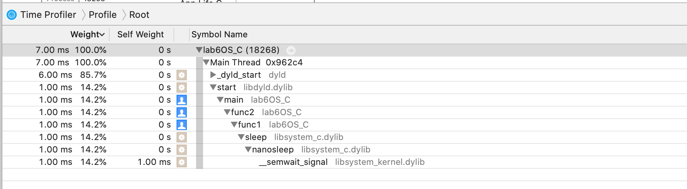

# Lab6: Профайлинг

```c
void new_func1(void);

int resultOfSum(int a, int b)
{
    return a+b;
}

int func1(int a, int b)
{
    int res = 0;
    for(int i = 0; i < 10; i++)
    {
        sleep(1);
        if(i>8)
            res = resultOfSum(a, b);
        if(res > 0)
            return res;
    }
    return res;
}
int func2(int a, int b)
{
    int res = 0;
    for(int i = 0; i < 10; i++)
    {
        int res = func1(a, b);
        if(res > 0)
            return res;
    }

    return 0 ;
}


int main(int argc, const char * argv[]) {
    func2(51, 110);
    return 0;
}

```
### Результат


